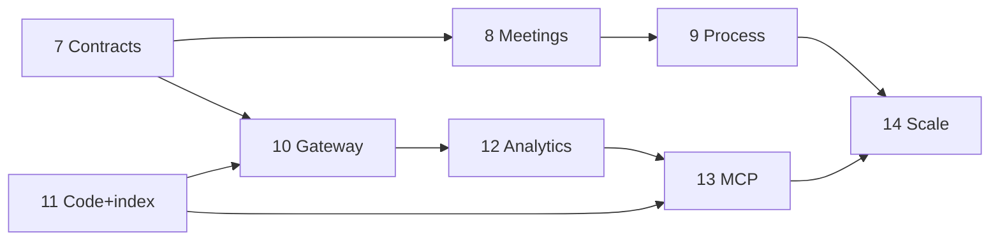

# Master implementation plan

**Version:** 2.1 · March 2026  
**Canonical roadmap** for this repository relative to **Enterprise Architecture v2.0** & **Process Architecture v2.0** (Automated Agile / Context Engineering Platform).

**Companion docs:** [context-platform-process-architecture.md](context-platform-process-architecture.md) · [roadmap-github-issues.md](roadmap-github-issues.md) · [agent-context-retrieval.md](agent-context-retrieval.md) · [decision-agent-fleet.md](decision-agent-fleet.md) · [deploy-runbook.md](deploy-runbook.md)

---

## 1. Executive summary

| Layer | State |
|-------|--------|
| **Spine** | Roadmap → story → D7 package → D8 sprint → D9 manufacturing → D10 triage → D11 improvements — **shipped** in SQLite + FastAPI + dashboard. |
| **Platform hardening** | Projects, auth, health, CLI seed/backup, Docker healthchecks — **shipped**. |
| **Integrations** | GitHub SCM webhook (push/ping) — **shipped**; PM/chat/MCP — **not**. |
| **Decision intelligence** | **D1–D12 decision agent fleet** + shared **`llm_client`** (`CONTEXT_LLM_MODEL`) — **shipped** (`GET/POST /api/context/decision-agents/...`). |
| **Codebase intelligence** | **Policy** ([agent-context-retrieval.md](agent-context-retrieval.md)); **indexed regex** implementation — **Phase 11** below. |
| **Enterprise target** | Seven systems, five UX surfaces, event bus, EA data contracts — **Phases 7–14**. |

---

## 2. Completed milestones (repo delivery history)

These map to README **agent phases 1–6** plus adjacent features.

| Milestone | What shipped |
|-----------|----------------|
| **P1 — Scope** | `project_id` on traceability rows; scoped APIs. |
| **P2 — Auth** | Optional dashboard session login; API key for `/api/*`. |
| **P3 — Manufacturing** | Git clone / optional patch / run command adapter; stub fallback. |
| **P4 — Meetings** | `meeting_agenda_items`, gap links, generate-agenda from gaps. |
| **P5 — SCM** | `POST /webhooks/scm/github`, HMAC, audit trail. |
| **P6 — Ops** | `/health`, `/ready`, `cli migrate|seed|backup`, deploy runbook, reference dataset. |
| **Satellite — Agent context policy** | Indexed regex + semantic dual-mode documented. |
| **Satellite — Decision fleet** | Twelve LLM agents, one model config, `invoke` API + audits. |

---

## 3. Next program phases (7–14) — at a glance

| Phase | Theme | Primary outcome |
|-------|--------|-----------------|
| **7** | **Contracts** | EA context package sections + gap contract; migrate from three JSON blobs. |
| **8** | **Meeting intelligence v2** | Extraction schema → EA arrays; `unresolved` → gaps; sufficiency stub. |
| **9** | **Process & tiers** | Readiness score; auto/quick/full confirmation; `process.*` events / outbox. |
| **10** | **Manufacturing gateway** | Explicit prompt compiler module; predicted queue heuristic. |
| **11** | **Codebase intel + regex index** | Mirror + trigram/sparse index; search API; pattern candidates. |
| **12** | **Feedback & observatory** | Q2 diff metadata; Q1/2/3 dashboards; baseline metrics (EA §9). |
| **13** | **MCP & bus** | MCP tools (graph, search, **decision invoke**); integration stubs; bus ADR. |
| **14** | **Enterprise scale** | HA/Postgres path; SSO; five UX surfaces map. |

**Fast regex** is delivered in **Phase 11**; **exposed to agents** in **Phase 13** (MCP). **grep-friendly package text** starts in **Phase 7** UX/contracts.

---

## 4. Enterprise build sequence vs this repo

| EA build phase | Repo status |
|----------------|-------------|
| Phase 0 — Manual proof | **External** validation assumed complete. |
| EA Phase 1 — Core loop | **Partial** — graph + meetings + workbench exist; depth in 7–8. |
| EA Phase 2 — Closed loop | **Partial** — manufacturing + triage; gateway/MCP/bus in 10/13. |
| EA Phase 3 — Intelligence | **Starting** — decision fleet ✓; codebase index in **11**. |
| EA Phase 4 — Scale | **14** |

---

## 5. Seven systems — coverage (condensed)

| # | System | Now | Next focus |
|---|--------|-----|------------|
| 4.1 | Meeting intelligence | Transcript + extract + D1 agenda | EA extraction shape, sufficiency, tiered confirm (8–9) |
| 4.2 | Codebase intelligence | Policy doc | **Indexed search** + patterns (**11**) |
| 4.3 | Context graph | SQLite relational | Richer contracts, auto-assembly (**7**) |
| 4.4 | Manufacturing gateway | Worker + API | Module boundary + prediction (**10**) |
| 4.5 | Feedback hub | D10 + improvements | Q2 diff, taxonomy (**12**) |
| 4.6 | Process orchestration | D7/D8 gates | Adaptive readiness (**9**) |
| 4.7 | Analytics | Audit lists | Observatory (**12**) |

---

## 6. Cross-cutting: LLM & decisions

- **One client:** [`llm_client.py`](../src/context_platform/llm_client.py) — `CONTEXT_LLM_MODEL`, optional base URL.
- **Meeting extraction** and **D1–D12 agents** share it ([`decision-agent-fleet.md`](decision-agent-fleet.md)).
- **Continuous improvement:** schedulers or MCP re-call `POST /decision-agents/{code}/invoke` with enriched `context` after triage or commits; human sign-off unchanged.

---

## 7. Data contracts (EA §5) — delta list

Align storage/API with EA **context package** sections (`technical_context`, `success_patterns`, `risks_and_dependencies`, structured **gaps**, **provenance**), **meeting extraction** arrays, and **triage** Q2/Q3 fields. Deliver incrementally inside **Phases 7–12** (see detailed checklists in archive note below).

---

## 8. Phase 7–14 — “done when” checklists

### Phase 7 — Context package & gap contracts
- [ ] Versioned package schema + migration from current JSON.
- [ ] Dashboard minimal support for new sections.
- [ ] D7 hash/snapshot rules preserved.

### Phase 8 — Meeting intelligence v2
- [ ] Draft JSON ↔ EA meeting extraction subset schema.
- [ ] `unresolved[]` → gap pipeline.
- [ ] API to list pending confirmations.

### Phase 9 — Process orchestration & tiered confirmation
- [ ] Readiness score stored and documented.
- [ ] At least one auto-accept rule + audit.
- [ ] Outbox or `process.*` audit events.

### Phase 10 — Manufacturing gateway
- [ ] `manufacturing_gateway` module + tests for prompt layout.
- [ ] Optional prediction field vs actual triage.

### Phase 11 — Codebase intelligence + indexed regex
- [ ] Mirror/index job + CLI/CI doc.
- [ ] Candidate search API + verify pass.
- [ ] `codebase.*` audit events + perf note.

### Phase 12 — Feedback hub & observatory
- [ ] Q2 optional diff attachment.
- [ ] Analytics API/dashboard slice + EA metric tiers doc.

### Phase 13 — MCP & integration backbone
- [ ] MCP server + tools (graph, search, decision invoke).
- [ ] One PM or chat stub + governance fields.
- [ ] Bus ADR (Kafka/EventBridge vs outbox).

### Phase 14 — Enterprise scale
- [ ] HA / Postgres path documented or implemented.
- [ ] SSO/OIDC stub.
- [ ] Five surfaces → routes table in README.

---

## 9. Dependency graph

---

## 10. Document control

| File | Role |
|------|------|
| **This file (`IMPLEMENTATION-PLAN.md`)** | **Single source of truth** for roadmap. |
| [implementation-phase-plan-enterprise-v2.md](implementation-phase-plan-enterprise-v2.md) | Redirect / history pointer. |
| [README.md](../README.md) | Summary table + links. |
| [roadmap-github-issues.md](roadmap-github-issues.md) | Issue breakdown. |

---

*Automated Agile Framework · Context Engineering Platform*
