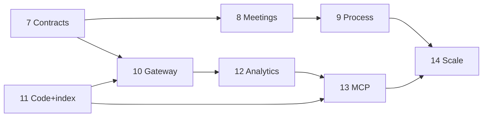

# Master implementation plan

**Version:** 2.1 · March 2026  
**Canonical roadmap** for this repository relative to **Enterprise Architecture v2.0** & **Process Architecture v2.0** (Automated Agile / Context Engineering Platform).

**Companion docs:** [context-platform-process-architecture.md](context-platform-process-architecture.md) · [roadmap-github-issues.md](roadmap-github-issues.md) · [agent-context-retrieval.md](agent-context-retrieval.md) · [codebase-index-phase11.md](codebase-index-phase11.md) · [ea-metric-tiers-phase12.md](ea-metric-tiers-phase12.md) · [decision-agent-fleet.md](decision-agent-fleet.md) · [deploy-runbook.md](deploy-runbook.md)

---

## 1. Executive summary

| Layer | State |
|-------|--------|
| **Spine** | Roadmap → story → D7 package → D8 sprint → D9 manufacturing → D10 triage → D11 improvements — **shipped** in SQLite + FastAPI + dashboard. |
| **Platform hardening** | Projects, auth, health, CLI seed/backup, Docker healthchecks — **shipped**. |
| **Integrations** | GitHub SCM webhook (push/ping) — **shipped**; PM/chat/MCP — **not**. |
| **Decision intelligence** | **D1–D12 decision agent fleet** + shared **`llm_client`** (`CONTEXT_LLM_MODEL`) — **shipped** (`GET/POST /api/context/decision-agents/...`). |
| **Codebase intelligence** | **Policy** + **Phase 11 MVP** ([codebase-index-phase11.md](codebase-index-phase11.md)) — CLI mirror, **`/codebase-search`**, regex verify, **`codebase.*`** audits. |
| **Enterprise target** | Seven systems, five UX surfaces, event bus, EA data contracts — **Phases 7–12 shipped**; **Phases 13–14** remain. |

---

## 2. Completed milestones (repo delivery history)

These map to README **agent phases 1–6** plus adjacent features.

| Milestone | What shipped |
|-----------|----------------|
| **P1 — Scope** | `project_id` on traceability rows; scoped APIs. |
| **P2 — Auth** | Optional dashboard session login; API key for `/api/*`. |
| **P3 — Manufacturing** | Git clone / optional patch / run command adapter; stub fallback. |
| **P4 — Meetings** | `meeting_agenda_items`, gap links, generate-agenda from gaps. |
| **P5 — SCM** | `POST /webhooks/scm/github`, HMAC, audit trail. |
| **P6 — Ops** | `/health`, `/ready`, `cli migrate|seed|backup`, deploy runbook, reference dataset. |
| **Satellite — Agent context policy** | Indexed regex + semantic dual-mode documented. |
| **Satellite — Decision fleet** | Twelve LLM agents, one model config, `invoke` API + audits. |
| **P7 — EA contracts** | Package snapshot **schema v3**: `success_patterns`, `risks_and_dependencies`, `section_provenance`; API `technical_context` alias; gap `severity_tier` + evidence / resolution / impact. |
| **P8 — Meeting intelligence v2** | Extraction draft **schema v2** (`unresolved[]`); promote to `context_gaps`; `GET .../pending-extraction-confirmation`. |
| **P9 — Process orchestration** | Stored `readiness_score` documented; quick-path rule + `process.*` audits + `process_outbox`; optional note-only extraction auto-accept. |
| **P10 — Manufacturing gateway** | `manufacturing_gateway` prompt bundle + Markdown; CI tests; `predicted_triage_queue` vs actual D10 in audits. |
| **P11 — Codebase index** | `codebase_index` + `codebase_index_entries`; CLI **`index-codebase`**; **`GET .../codebase-search`** + verify; docs + unittest. |
| **P12 — Feedback & observatory** | Q2 optional **`diff_attachment`** in triage `detail_json`; **`GET .../analytics-summary`**; dashboard Observatory card; [ea-metric-tiers-phase12.md](ea-metric-tiers-phase12.md). |

---

## 3. Next program phases (7–14) — at a glance

| Phase | Theme | Primary outcome |
|-------|--------|-----------------|
| **7** | **Contracts** | **Done** — EA package extensions + gap contract fields; SQLite migration; D7 hash includes extensions. |
| **8** | **Meeting intelligence v2** | **Done** — EA extraction subset + `unresolved[]` → gaps + pending-confirmation API. |
| **9** | **Process & tiers** | **Done** — readiness on `context_packages`; env-gated quick path + note-only auto-accept; `process_outbox` + `GET/POST .../process-outbox`. |
| **10** | **Manufacturing gateway** | **Done** — `manufacturing_gateway` module; `GET .../manufacturing-prompt`; prediction column + audit match fields. |
| **11** | **Codebase intel + regex index** | **Done (MVP)** — SQLite mirror + substring `LIKE` + optional regex verify; **`codebase.*`** audits; [codebase-index-phase11.md](codebase-index-phase11.md). |
| **12** | **Feedback & observatory** | **Done** — Q2 optional diff (`detail_json.diff_attachment`); **`GET .../analytics-summary`**; dashboard slice + EA metric tiers doc. |
| **13** | **MCP & bus** | MCP tools (graph, search, **decision invoke**); integration stubs; bus ADR. |
| **14** | **Enterprise scale** | HA/Postgres path; SSO; five UX surfaces map. |

**Phase 11** ships a **portable substring index + verify** (trigram/FTS scale-up later). **Exposed to agents** broadly in **Phase 13** (MCP). **grep-friendly package text** starts in **Phase 7** UX/contracts.

---

## 4. Enterprise build sequence vs this repo

| EA build phase | Repo status |
|----------------|-------------|
| Phase 0 — Manual proof | **External** validation assumed complete. |
| EA Phase 1 — Core loop | **Partial** — graph + meetings + workbench exist; depth in 7–8. |
| EA Phase 2 — Closed loop | **Partial** — manufacturing + triage; gateway/MCP/bus in 10/13. |
| EA Phase 3 — Intelligence | **Advancing** — decision fleet ✓; codebase index **MVP (11)** ✓. |
| EA Phase 4 — Scale | **14** |

---

## 5. Seven systems — coverage (condensed)

| # | System | Now | Next focus |
|---|--------|-----|------------|
| 4.1 | Meeting intelligence | Transcript + extract + D1 agenda | EA extraction shape, sufficiency, tiered confirm (8–9) |
| 4.2 | Codebase intelligence | Policy + **CLI/API index (11)** | Trigram / FTS scale-up; MCP (**13**) |
| 4.3 | Context graph | SQLite relational | Richer contracts, auto-assembly (**7**) |
| 4.4 | Manufacturing gateway | Worker + API + **gateway Markdown** | Compiler/tests (**10**); deeper codegen in later phases |
| 4.5 | Feedback hub | D10 + improvements + **Q2 diff attachment (12)** | Deeper taxonomy / PM links (**13+**) |
| 4.6 | Process orchestration | D7/D8 gates + Phase 9 outbox / `process.*` | Adaptive tiers deepen in ops (**9** shipped MVP) |
| 4.7 | Analytics | **`GET /analytics-summary`** + dashboard · [ea-metric-tiers-phase12.md](ea-metric-tiers-phase12.md) | Warehouse / cross-project (**14**) |

---

## 6. Cross-cutting: LLM & decisions

- **One client:** [`llm_client.py`](../src/context_platform/llm_client.py) — `CONTEXT_LLM_MODEL`, optional base URL.
- **Meeting extraction** and **D1–D12 agents** share it ([`decision-agent-fleet.md`](decision-agent-fleet.md)).
- **Continuous improvement:** schedulers or MCP re-call `POST /decision-agents/{code}/invoke` with enriched `context` after triage or commits; human sign-off unchanged.

---

## 7. Data contracts (EA §5) — delta list

Align storage/API with EA **context package** sections (`technical_context`, `success_patterns`, `risks_and_dependencies`, structured **gaps**, **provenance**), **meeting extraction** arrays, and **triage** Q2/Q3 fields. Deliver incrementally inside **Phases 7–12** (see detailed checklists in archive note below).

---

## 8. Phase 7–14 — “done when” checklists

### Phase 7 — Context package & gap contracts
- [x] Versioned package schema + migration from current JSON (`package_schema_version` **3**; snapshot `schema_version` **3**; new SQLite columns + idempotent `ALTER`).
- [x] Dashboard minimal support for new sections (success patterns, risks & dependencies, provenance JSON; EA gap tier + evidence fields).
- [x] D7 hash/snapshot rules preserved (canonical payload includes extensions; `content_hash` covers full frozen document).

### Phase 8 — Meeting intelligence v2
- [x] Draft JSON ↔ EA meeting extraction subset schema (`extraction_schema_version` **2**; `proposed_items` + `unresolved[]`; `normalize_extraction_draft` / `meeting_extraction_schema.py`; LLM + stub emit `unresolved`).
- [x] `unresolved[]` → gap pipeline (`POST .../unresolved-to-gaps`, dashboard form; audit `meeting_unresolved_promoted_to_gaps`).
- [x] API to list pending confirmations (`GET .../meetings/pending-extraction-confirmation`).

### Phase 9 — Process orchestration & tiered confirmation
- [x] Readiness score stored and documented (`context_packages.readiness_score`; recomputed on PATCH via `compute_readiness_with_extensions`; README / `.env.example`).
- [x] At least one auto-accept rule + audit (`CONTEXT_PROCESS_AUTO_ACCEPT_NOTE_ONLY_EXTRACTION` → `process.meeting_extraction_auto_accepted` + outbox; quick-path rule below).
- [x] Outbox or `process.*` audit events (`process_outbox` table; audits `process.package_quick_path_eligible`, `process.meeting_extraction_auto_accepted`; `GET/POST /api/context/process-outbox/*`).

### Phase 10 — Manufacturing gateway
- [x] `manufacturing_gateway` module + tests for prompt layout (`tests/test_manufacturing_gateway.py`, CI `unittest discover`).
- [x] Optional prediction field vs actual triage (`predicted_triage_queue` on `manufacturing_requests`; `prediction_matches_actual` on D10 audit/decision; optional `CONTEXT_MANUFACTURING_AUTO_PREDICT_TRIAGE`).

### Phase 11 — Codebase intelligence + indexed regex
- [x] Mirror/index job + CLI/CI doc (`cli index-codebase`, [codebase-index-phase11.md](codebase-index-phase11.md), deploy runbook §4b, CI unittest).
- [x] Candidate search API + verify pass (`GET /api/context/codebase-search`, `verify_pattern`, `CONTEXT_CODEBASE_INDEX_ROOT`).
- [x] `codebase.*` audit events + perf note (`codebase.index_completed`, `codebase.search` with `duration_ms`; perf section in doc).

### Phase 12 — Feedback hub & observatory
- [x] Q2 optional diff attachment (`TriageSubmit.diff_*` → `detail_json.diff_attachment`; cap + audit `has_diff_attachment`).
- [x] Analytics API/dashboard slice + EA metric tiers doc (`GET /analytics-summary`, dashboard Observatory card, [ea-metric-tiers-phase12.md](ea-metric-tiers-phase12.md)).

### Phase 13 — MCP & integration backbone
- [ ] MCP server + tools (graph, search, decision invoke).
- [ ] One PM or chat stub + governance fields.
- [ ] Bus ADR (Kafka/EventBridge vs outbox).

### Phase 14 — Enterprise scale
- [ ] HA / Postgres path documented or implemented.
- [ ] SSO/OIDC stub.
- [ ] Five surfaces → routes table in README.

---

## 9. Dependency graph

---

## 10. Document control

| File | Role |
|------|------|
| **This file (`IMPLEMENTATION-PLAN.md`)** | **Single source of truth** for roadmap. |
| [implementation-phase-plan-enterprise-v2.md](implementation-phase-plan-enterprise-v2.md) | Redirect / history pointer. |
| [README.md](../README.md) | Summary table + links. |
| [roadmap-github-issues.md](roadmap-github-issues.md) | Issue breakdown. |

---

*Automated Agile Framework · Context Engineering Platform*
