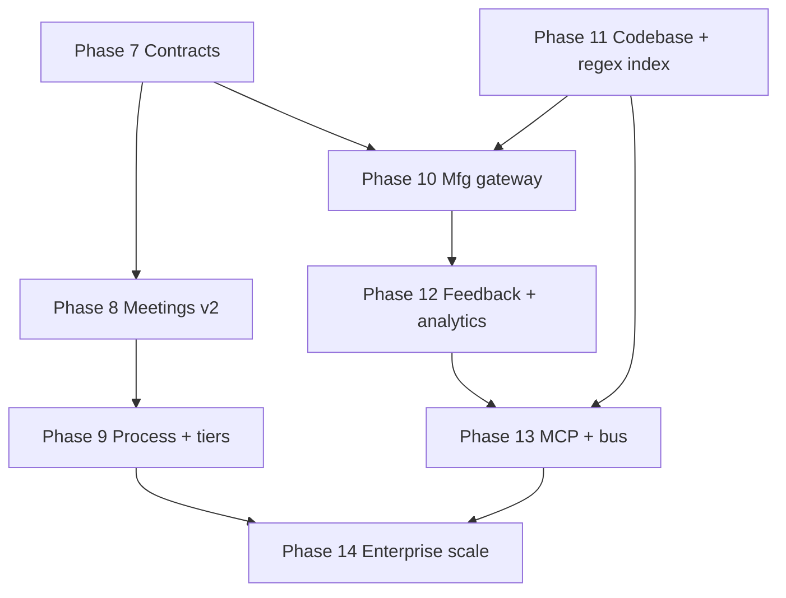

# Implementation phase plan — Enterprise & process architecture v2.0

**Version:** 1.0 · March 2026  
**Aligns to:** Context Engineering Platform — *Enterprise Architecture v2.0* & *Process Architecture v2.0* (Automated Agile Framework)  
**Companion:** [agent-context-retrieval.md](agent-context-retrieval.md) (indexed regex + semantic retrieval for agents) · [context-platform-process-architecture.md](context-platform-process-architecture.md) (v1.0 repo doc) · [roadmap-github-issues.md](roadmap-github-issues.md)

This document is the **forward-looking phase plan** for this repository after README **agent phases 1–6** (project scope, dashboard auth, manufacturing git adapter, meeting agenda, SCM webhook, ops hardening). It translates the **seven systems**, **four value streams**, **data contracts**, and **build sequence** from the enterprise/process specs into **concrete delivery phases** for the reference implementation—**including explicit placement of fast regex / indexed text search** in Codebase Intelligence.

---

## 1. Current position vs enterprise build sequence

| Enterprise build phase | Meaning in EA doc | This repo (reference impl.) |
|------------------------|-------------------|------------------------------|
| **Phase 0 — Manual proof** | Validated; Q1 40–50% with manual tooling | **Assumed complete** (external validation). |
| **Phase 1 — Core loop** | Context Graph (basic), Meeting Intelligence, Workbench | **Partial:** SQLite graph (roadmap → story → package), meetings + extraction stub, HTML workbench = dashboard. |
| **Phase 2 — Closed loop** | Manufacturing Gateway, Feedback Hub, Process engine, MCP | **Partial:** D9 manufacturing + D10 triage + improvements; SCM webhook; **no** MCP, **no** real event bus, **no** separate gateway service. |
| **Phase 3 — Intelligence** | Codebase Intelligence, Analytics, full process engine | **Minimal:** readiness/heuristics only; **no** pattern library engine; **no** indexed codebase search. |
| **Phase 4 — Scale** | Five UX surfaces, multi-team, SSO, compliance | **Not started** (single-tenant SQLite MVP). |

**Conclusion:** Treat **enterprise Phase 1–2** as *in progress* in code, **Phase 3–4** as *roadmapped below*.

---

## 2. Seven systems — coverage matrix

| System | EA responsibility | In repo today | Gap |
|--------|-------------------|---------------|-----|
| **4.1 Meeting Intelligence** | Transcribe, extract, gap agenda, sufficiency | Transcript + LLM/stub extraction, D1 agenda from gaps, **no** live sufficiency | Real-time sufficiency; extraction schema = EA `Meeting Extraction`; tiered confirmation; calendar/bot integrations |
| **4.2 Codebase Intelligence** | Mirrors, AST, patterns, change impact | **Policy only** [agent-context-retrieval.md](agent-context-retrieval.md); manufacturing clone is bounded, not a corpus index | **Indexed regex search** (trigram / sparse n-gram family) + optional semantic; pattern detection job; `codebase.*` events |
| **4.3 Context Graph** | Canonical graph store, auto-assembly | SQLite relational model + `project_id`; **no** graph DB or `similar_to` edges | Richer entities/edges; auto-assembly job; `success_patterns` & `provenance` as first-class |
| **4.4 Manufacturing Gateway** | Prompt build, orchestration, predicted queue | FastAPI + background worker; package → manufacturing | Explicit **gateway** module/API; prompt-section mapping; **predicted queue** (heuristic → model later) |
| **4.5 Feedback Hub** | Triage, Q2 differential, routing | D10 structured triage, improvement items | Q2 **diff** capture; failure taxonomy alignment with EA `Triage Feedback`; feedback → gap automation |
| **4.6 Process Orchestration** | Gates, adaptive process | D7/D8 gates, env overrides | Readiness-driven **adaptive** steps; process events; optional outbox → future Kafka/EventBridge |
| **4.7 Analytics** | Correlation, experiments, Observatory | Audit + lists; **no** correlation engine | Baseline metrics (EA §9); drill-down dashboards; **hypothesis** tier only until baseline sprints |

---

## 3. Four value streams — instrumentation targets

| Value stream | EA measures | Repo instrumentation (target) |
|--------------|-------------|----------------------------------|
| **Context accumulation** | Capture rate, latency, passive vs manual | Webhook/event ingest counters; time-to-`audit_events`; ratio of API-created vs integration-created entities |
| **Context intelligence** | Completeness, gap accuracy, time to refined | Package section scores; gap open/resolve SLA; extraction confidence fields |
| **Software manufacturing** | Q1 rate, cycle time, hours saved | Existing triage queues + manufacturing status; add baseline dashboard (Observatory slice) |
| **Feedback & learning** | Queue migration, revision frequency, pattern growth | Link triage → package version bumps; pattern table growth (once G exists) |

---

## 4. Data contracts — priority deltas (EA §5 vs repo)

The **Context Package** in EA v2.0 names sections and fields beyond the current three JSON blobs (`business_context`, `technical_approach`, `testing_contract`).

| EA contract area | Action |
|------------------|--------|
| **`technical_context`** vs `technical_approach` | Align naming & shape in schema + API; map legacy `technical_approach` in migrations. |
| **`success_patterns`** | New structured section + links to pattern library rows (when G exists). |
| **`risks_and_dependencies`** | New section or sub-object; tie to D2/D3 process outputs. |
| **`gaps`** | Formalise EA **Context Gap** fields (severity, evidence, resolution, impact) vs current `context_gaps` + readiness hints. |
| **`provenance`** | Per-section source trail + confidence; extend `artifacts` / audit or embed in package snapshot. |
| **Meeting extraction** | Normalise draft JSON toward EA arrays: `decisions`, `requirements`, `action_items`, `clarifications`, `unresolved`. |
| **Triage feedback** | Extend D10 payloads for Q2 differential (what dev changed) and Q3 categories per EA table. |

*Deliver these incrementally inside the phases below—no big-bang rewrite.*

---

## 5. Fast regex process — where it lands

Per [agent-context-retrieval.md](agent-context-retrieval.md):

| Capability | Phase (this doc) |
|------------|------------------|
| **Local / sidecar indexed search** over mirrored repo (trigram inverted index → verify with regex; sparse n-grams or equivalent for scale) | **Phase 11 — Codebase Intelligence v1** |
| **Agent-facing tools** exposing that index (MCP `search_code` / `rg_indexed` style) | **Phase 13 — MCP & integration backbone** (depends on 11) |
| **Context package authoring** includes grep-stable literals for hybrid human+agent workflows | Ongoing in **Phase 7** (contract) + workbench UX |

**Non-goal for early phases:** reimplementing the entire Cursor editor stack; **goal:** a **documented, swappable** index (embedded library or subprocess to `zoekt`/codesearch-compatible artifact) + API hooks.

---

## 6. Implementation phases (7–14) — “done when”

Phases **7–14** continue after README **agent phases 1–6**. Each phase has a **single primary outcome** testable without the whole enterprise stack.

---

### Phase 7 — Context package & gap contracts (EA §5.1, §5.4)

**Outcome:** Storage + API reflect EA package sections (at minimum: `technical_context`, `risks_and_dependencies`, `success_patterns` stubs, structured `gaps` metadata) with **backward-compatible migration** from current v2 package JSON.

**Done when:**
- [ ] Pydantic models + SQLite columns or JSON sub-documents versioned (`package_schema_version` bump).
- [ ] Dashboard/workbench can view/edit new sections (minimal UI).
- [ ] D7 snapshot still hashes approved packages; migration path documented.

---

### Phase 8 — Meeting intelligence v2 (EA §4.1, process §4)

**Outcome:** Extraction payload shape moves toward EA **Meeting Extraction**; **gap-driven agenda** gains severity/prompt fields; optional **sufficiency** stub (manual status per agenda line before full NLP).

**Done when:**
- [ ] Draft extraction JSON validates against a published JSON Schema subset of EA.
- [ ] `unresolved[]` round-trips into gap pipeline.
- [ ] REST: list/filter extractions pending confirmation (tiered confirm = Phase 9 hook).

---

### Phase 9 — Process orchestration & tiered confirmation (EA §4.6, §7.1)

**Outcome:** Story/package **readiness score** exposed on API and dashboard; **auto / quick / full** confirmation paths for extractions (rules-based thresholds first); audit trail for each tier.

**Done when:**
- [ ] Readiness score formula documented and stored per story/package.
- [ ] At least one automated rule (e.g. high-confidence extraction → auto-accept flag) + audit event.
- [ ] `process.*` events written to `audit_events` or outbox table (design for future Kafka).

---

### Phase 10 — Manufacturing gateway (EA §4.4)

**Outcome:** Clear **gateway** boundary in code: compile context package sections → manufacturing job payload + metadata; optional **predicted queue** heuristic (completeness + historical stub).

**Done when:**
- [ ] Module or service package `manufacturing_gateway` (still invocable in-process) with unit tests on prompt/layout shape.
- [ ] Manufacturing request records `prediction` + actual triage queue when available.

---

### Phase 11 — Codebase intelligence v1 + **indexed regex search** (EA §4.2 + fast regex)

**Outcome:** **Repository mirror** (or shallow fetch) per project; **build search index** (trigram-family or integration with existing engine); **pattern candidates** table + API; link candidates to stories/packages.

**Done when:**
- [ ] Index build job documented (`make index` / CLI) and reproducible on CI sample repo.
- [ ] Search API returns candidate file paths + line hints; final match verified by regex scan of candidates only.
- [ ] `codebase.pattern.detected` (or equivalent) audit events emitted.
- [ ] Performance target stated (e.g. p95 query latency vs full `rg` on same corpus)—measurement in Observatory stub (Phase 12).

---

### Phase 12 — Feedback hub & observatory baseline (EA §4.5, §4.7, §9)

**Outcome:** Q2 **differential** attachment (diff snippet or file list); sprint-level **Queue distribution** + context completeness charts; **no fake causality**—correlation labels only.

**Done when:**
- [ ] Triage API accepts optional “developer final diff” metadata for Q2.
- [ ] Dashboard or `/api` analytics slice: Q1/Q2/Q3 counts, completeness at manufacturing, export JSON.
- [ ] README documents **baselined vs hypothesis** metrics per EA §9.

---

### Phase 13 — MCP & integration backbone (EA §6)

**Outcome:** **MCP server** exposing read-only context graph + **indexed code search** tool; expand webhooks (Jira/Linear stub); **event bus** design doc + optional SQLite outbox pattern.

**Done when:**
- [ ] MCP server package runs beside API (or separate container) with documented tool list.
- [ ] At least one PM tool **or** chat integration stub with governance fields (opt-in) from EA §6.3.
- [ ] ADR: async bus (Kafka/EventBridge) vs outbox.

---

### Phase 14 — Enterprise scale (EA Phase 4)

**Outcome:** PostgreSQL option **or** read replicas path; SSO/OIDC stub; **five UX surfaces** mapped to routes (War Room home, Meeting Room, Workbench, Factory Floor, Observatory)—can be progressive web enhancement over current dashboard.

**Done when:**
- [ ] Deployment guide updated for HA / multi-instance.
- [ ] Role model documented (PO, CE, TL, Dev) beyond shared dashboard password.
- [ ] Surface map: URL → persona → primary intent (table in README).

---

## 7. Dependencies (high level)

---

## 8. Document control

| Artifact | Role |
|----------|------|
| This file | **Source of truth** for *next* implementation waves (7–14). |
| [README.md](../README.md) | Quick links + status table; keep agent phases 1–6 as historical. |
| [roadmap-github-issues.md](roadmap-github-issues.md) | Epic/issues; add GitHub issues from phase checklists as work is scheduled. |

When enterprise PDFs are checked into `docs/`, add links here under *References*.

---

*Context Engineering Platform — internal implementation plan. Automated Agile Framework.*
